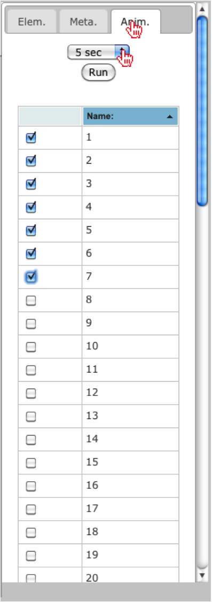
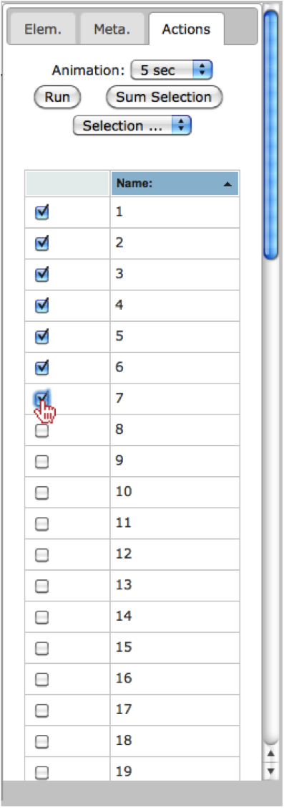
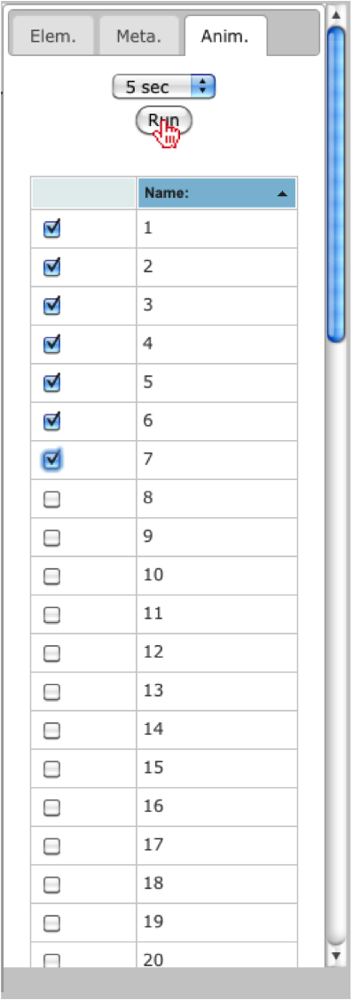

.. _edit_svg:

============================
Generate Animation
============================

To generate an animation, the user should first select the "Anim." tab in the right menu.  Once selected, the user will have the option of setting the time for each static image to appear (i.e. 5, 10, 15 or 20 seconds).

The user should also select the categories to show within the animation, by checking the box next to each category.

Once the options have been selected the user should click on the "Run" button to animate the iteration over each of the selected categories.

