.. _tutorial_index:
.. SitePainter  documentation master file, created by
   sphinx-quickstart on 9/15/2011.
   You can adapt this file completely to your liking, but it should at least
   contain the root `toctree` directive.

.. index:: Tutorials

==========================
SitePainter Tutorial
==========================
This tutorial illustrates the functional capabilities of SitePainter, where the user can load an SVG image along with associated metadata (in tab-delimited format). Once the data is loaded, the user can color the image by the metadata using a color gradient. For this tutorial, we will use an illustration, where we sampled regions of a human hand, followed by sequencing of the microbial communities associated to each region. For the analysis of this sequence dataset we analyzed the microbial diversity between regions (using principal coordinates analysis) and taxonomic summaries for the microbial communities present in each region of human hand, using the QIIME software package [1]_.

Getting Started
--------------------
To begin this tutorial, you should first download and unzip the tutorial files `here <http://sitepainter.sourceforge.net/files/SitePainter_example_files.zip>`_.  Next, you should open the SitePainter :file:`index.html`.

Load Files
--------------
First, you must open the svg image of the hand (:file:`hand.svg`) by clicking on the main menu and selecting "Open Image", where you will need to navigate to the tutorial files on your computer. 

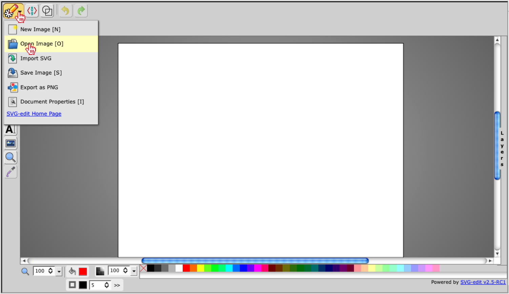

Once you have selected the  :file:`hand.svg` image, you should "Open" the file.

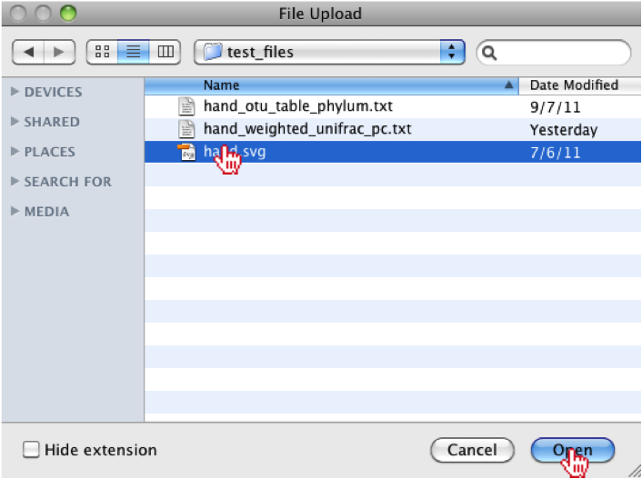
    
.. note::
   
   It should be noted that the "Import SVG" option does not behave properly so it is highly recommended that users use the "Open Image" option. 

Now that the image is loaded, we need to open the associated metadata by clicking on the "Browse" button in the top-menu. 

.. image:: ../images/click_browse_metadata.png
    :align: center
    :width: 500px
    
The user should navigate to the tutorial files again and should select either the principal coordinate file (:file:`hand_weighted_unifrac_pc.txt`) or the summarized taxonomy file (:file:`hand_otu_table_phylum.txt`), which were produced by QIIME. For this tutorial, we will select and open the :file:`hand_weighted_unifrac_pc.txt` file. 

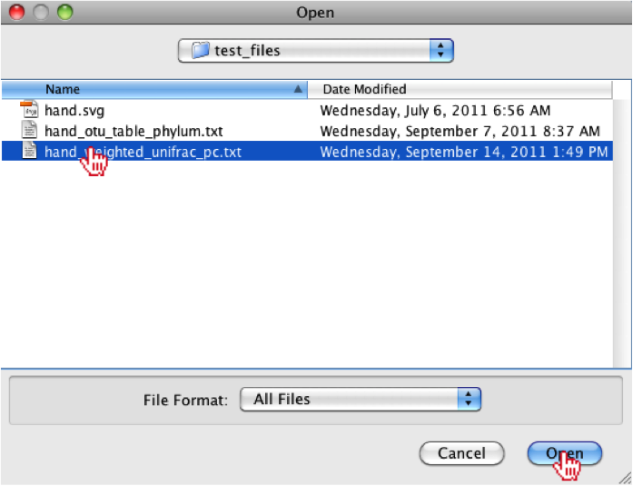

.. note::

    It should be noted that user's can also generate their own tab-delimited metadata files. 

Once the user has opened the file, they should notice that the right-menu under the "Meta." tab is now populated with the associated metadata, where they can sort the columns.

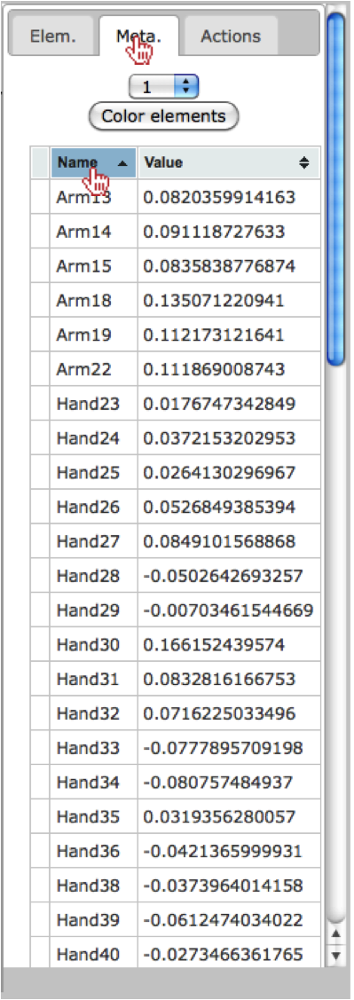

Coloring elements
-------------------
Now that the SVG and metadata have been loaded, we can color the principal coordinate axes onto the hand image by select a principal coordinate vector from the drop-down menu under the "Meta." tab in the right menu.  To view the colors, the user should click on the "Color elements" button where they will see the values colored from low (blue) -> high (red) values.

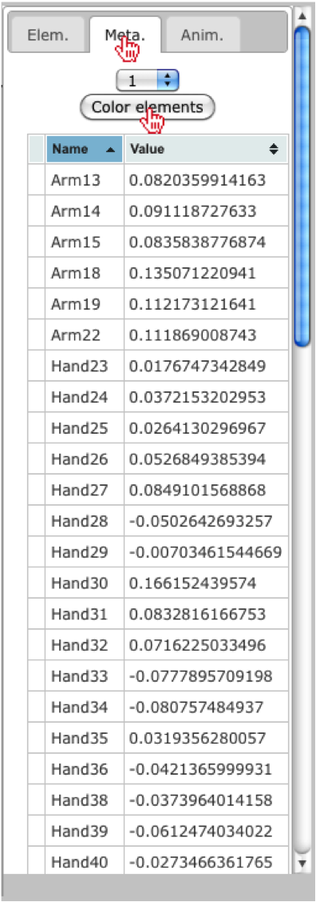
    
Once the button has been clicked, the user should observe the colors have been painted onto the hand, where the colors correspond to the values from principal coordinate vector 1.

.. image:: ../images/colored_hand_blue_red.png
    :align: center
    :height: 400px
    
The user should also notice that the colors have been added to each value in the right menu.

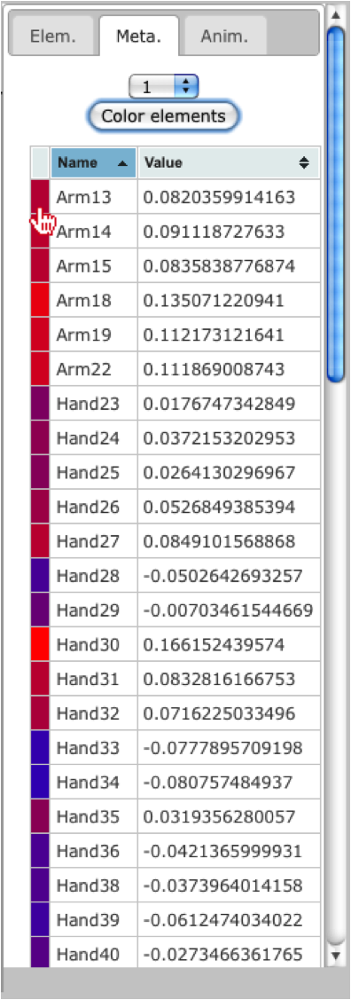
    
Change Colors 
----------------

Now that we have painted the colors onto the hand image, we can also change the color gradient. To do this, the user should click on the blue color under the Low field in the top-menu. 

.. image:: ../images/click_blue_low.png
    :align: center
    :width: 500px
    
Once selected, the user will see a color chart appear, where they can select another color, such as green. 

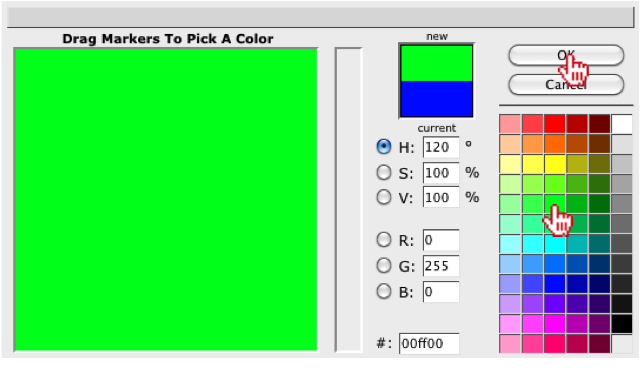

Next, the user can click on the red color under the High field in the top-menu.

.. image:: ../images/click_red_high.png
    :align: center
    :width: 500px

For the new high value, the user can select another color, such as yellow.

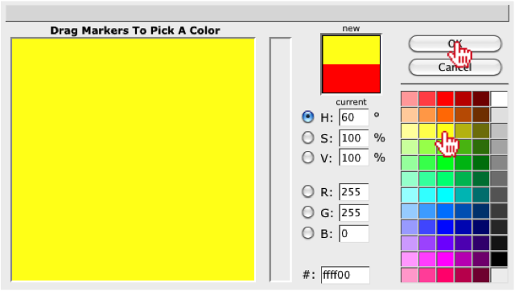

Once the colors have been set, the user can recolor the image using the new colors, by clicking on the "Color elements" button in the right-menu under the "Meta." tab.

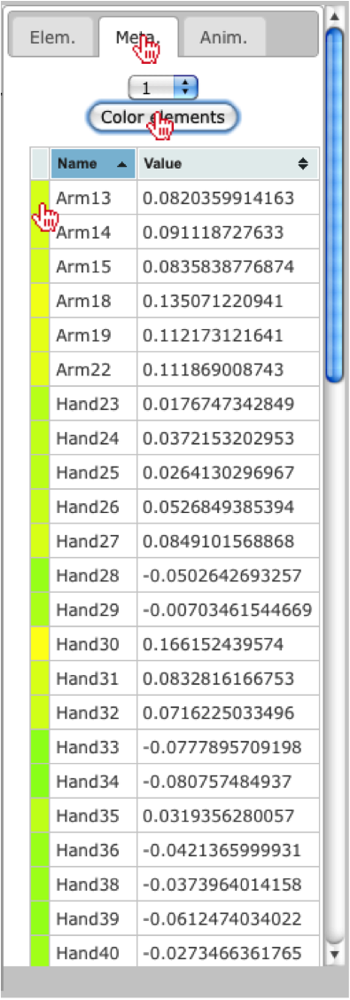

The user should also see the colors update on the hand image.

.. image:: ../images/hand_updated_colors.png
    :align: center
    :height: 400px

Show/Hide Lines and Paths
-------------------------------------

The user also has the ability to show/hide lines by selecting an option under the Lines field in the top-menu.  By selecting "Hide" the user will see the lines around each region disappear.

.. image:: ../images/hide_lines.png
  :align: center
  :width: 500px

The user should notice the lines disappear around each region of their image.

.. image:: ../images/hand_hidden_lines.png
  :align: center
  :height: 400px
    
If the user wants to remove the paths within an image, they can select the "Hide" option under the Paths field in the top-menu.

.. image:: ../images/hide_paths.png
  :align: center
  :width: 500px
  
The user should notice the paths disappear around each region of their image.

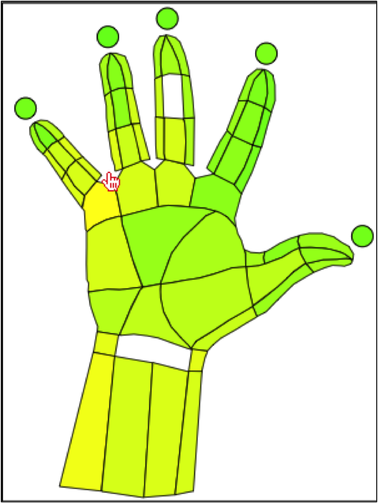
    
Reset Image Colors
---------------------

Now that we have manipulated the colors of the image, we can reset the colors by clicking on the "Color All" button under the Reset color field in the top-menu.  Additionally, users can change the default reset color by clicking on the white box under the same field, which allows the user to select a new default color.

.. image:: ../images/reset_colors.png
    :align: center
    :width: 500px
    
Create Animation
-----------------

Since there several principal coordinate vectors, the user may want to create an animation, where each category is mapped onto the hand for a short amount of time, then it iterates to the next category. This allows the user to view the mapping of each category without having to select and map each category onto the image.  To generate an animation, the user should select the "Actions" tab in the right-menu. Once selected, we will leave the default timer as 5 seconds.

.. image:: ../images/anim_select_time.png
    :align: center
    :height: 400px
    
Next, we will select a few of the principal coordinate vectors we would like to map onto the hand (i.e., 1,2,3,4,5,6 and 7). 

.. image:: ../images/anim_select_categories.png
    :align: center
    :height: 400px

Now that we have selected the vectors we want to see mapped onto the hand, the user should click on the "Run" button.

.. image:: ../images/anim_run.png
    :align: center
    :height: 400px
    
Finally, the user can choose to summarize the selected categories by clicking on the "Sum Selection" button.

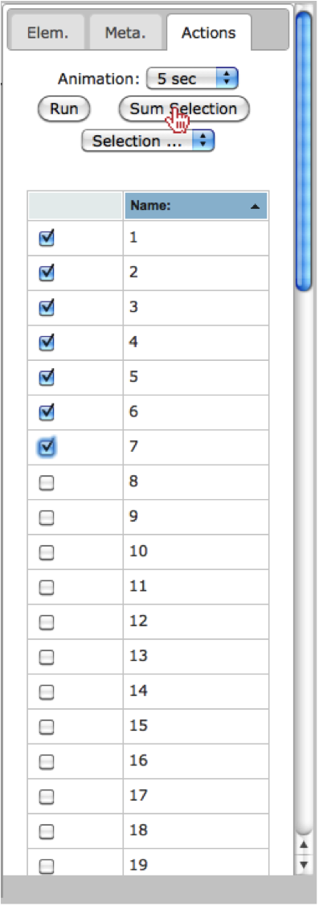
    
    
Conclusion
-----------

This completes the tutorial, where we illustrate many of the functionalities currently available in SitePainter. I suggest the user repeats these steps, however; instead of opening the principal coordinates file, I suggest the user opens the summarized taxonomy file (:file:`hand_otu_table_phylum.txt`) to visualize the Phylum-level abundance at each region of the hand.

References
----------------------------- 

.. [1] Caporaso, J.G., Kuczynski, J., Stombaugh, J., Bittinger, K., Bushman, F.D., Costello, E.K., Fierer, N., Pena, A.G., Goodrich, J.K., Gordon, J.I., Huttley, G.A., Kelley, S.T., Knights, D., Koenig, J.E., Ley, R.E., Lozupone, C.A., McDonald, D., Muegge, B.D., Pirrung, M., Reeder, J., Sevinsky, J.R., Turnbaugh, P.J., Walters, W.A., Widmann, J., Yatsunenko, T., Zaneveld, J. and Knight, R. (2010) QIIME allows analysis of high-throughput community sequencing data, Nat Methods, 7, 335-336.

